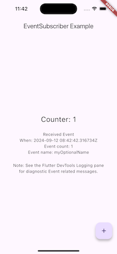
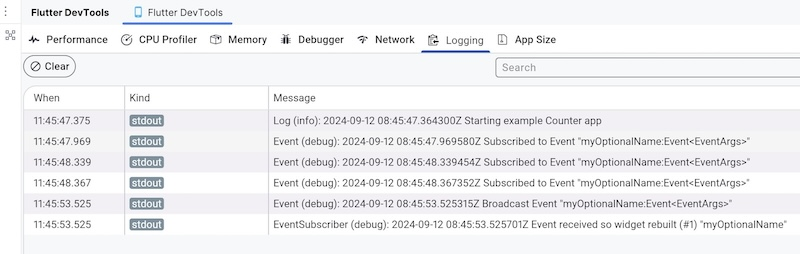

# Changelog - EventSubscriber

## Version 3.0.0  (2024-09-11)

> This version has BREAKING CHANGES.
> 
> See also the `Event` package CHANGELOG.md file for changes in that associated package.
> 
>https://github.com/aryehof/dart-event

> The example app has been updated to show new features and changes.
> 



1. Minimum Dart sdk dependency is now 3.4.0


2. EventSubscriber can now subscribe to multiple events. This means that parameter `event` has been replaced by `events` (plural).

   - Specify one or more Events as a List [ ].

    ```dart
      // before, now deprecated
      EventSubscriber(
        event: myCounter.changedEvent, // deprecated
        builder: ...
    
      // current version
      EventSubscriber(
        events: [myCounter.changedEvent, myCounter.otherEvent],  // <<==
        builder: ...
    ```
    - EventSubscriber will rebuild when any of the Events listed occur.


3. You can now determine which Event occured via the EventArgs `eventName` property. Note that the name must be set when declaring the Event, or else the value will be null.


4. The `EventSubscriber` `builder` parameter now expects a function (handler) that takes 3 arguments:- a `context`, a `status` and `args`.
   - Previously just a `context` and `args` was required.

    ```dart
      // status added as a builder function argument
      EventSubscriber(
        events: [myCounter.valueChangedEvent],
        builder: (context, status, args) { ...   // <<== change
    ```

   - The status argument represents an instance of EventStatus, which provides 2 properties that you can access in your handler:-
     - `numEventsReceived`- the cumulative number of a particular Event received.
     - `hasReceivedFirstEvent`- true if an Event has been received, else false.
       - An EventSubscriber will be initially displayed without having received an Event, i.e. `numEventReceived` will be 0, and `hasReceivedFirstEvent` will be false;
       - Note, that `hasReceivedFirstEvent` is merely a convenience function that is equivalent to checking if `numEventsReceived == 0`.

        ```dart
          // example using status
          EventSubscriber(
            events: [myCounter.valueChangedEvent],
            builder: (context, status, args) {
              print(status.numEventsReceived);
              print(status.hasReceivedFirstEvent);
            },
          )
        ```


5. Diagnostic logging is available via the associated `Event` package/dependency.
    - A debug level message is output whenever an EventSubscriber is rebuilt.
    - Your app must first call `showLog()` with `Severity.debug` or `Severity.all` for this message to be output.
    - View messages in the Flutter DevTools Logging pane.
    
     ```
     // example output  
     EventSubscriber (debug): 2024-09-11 08:01:52.951224Z Event received so widget rebuilt (#1) "myEventName"
     ```
      
     The number in brackets (#1) shows the cumulative number of times the Event received.




## Version 2.1.3  (2022-01-11)

- Improvements to README
- Minor refactorings

## Version 2.1.0  (2022-01-09)

- **Breaking Change**. The argument [handler] has been renamed to [builder] to be consistent with Flutter library APIs.
- The internal [ArgsBuilder] and [_ArgsWidgetBuilder] classes have been made private.
- Example application and test now works correctly.

## Version 2.0.0  (2021-05-10)

- Updated for null safety
- A working Flutter example is provided in the example folder.

## Version 1.2.1  (2020-02-17)

- The [Event] name in the example folder changed to show a standard [Event Naming Pattern][EventNamingPattern].  In this pattern:-
  - Events are suffixed with '*Event*' e.g. `valueChangedEvent`.
  - If there is the need to wrap the broadcasting of the event in a function containing some additional processing or validation, then one would do so in a function prefixed with '*on*' e.g. `onValueChanged`.
    - The suffix '*Event*' is removed from the 'on' function name.
    - The event is prefixed with an underscore ('_') to indicate that it is private and that the on.. method should be used to broadcast that the event has occurred.
    ```dart
    // Event Naming Pattern -  ..Event, on..
    var _valueChangedEvent = Event();
    
    void onValueChanged() {
      // Some processing or validation
      if (someImportantValue != null) {
        _valueChangedEvent.broadcast();
      }
    }

    // One would indicate that the event occurred ...
    onValueChanged()
    ```

## Version 1.2.0  (2020-02-09)

- **Breaking Change**. Event arguments [EventArgs] are now supported.
  - The `builder` argument has been renamed to `handler`, to better reflect that you are supplying a subscriber handler that is called when the event is `broadcast`.
  - A handler requires now two arguments, the first representing the BuildContext, and the second the (optional) [EventArgs] associated with the Event.
    - _before:_
      ~~```builder: (context) => Text(myCount.value.toString()),```~~
    - _after:_
        ```handler: (context, args) => Text(myCount.value.toString()),```
  
  ```dart
  ...
  EventSubscriber(
    event: myCount.onValueChanged,
    handler: (context, args) => Text(myCount.value.toString()),

    // If an Event has arguments, they are now available in your handler.
    // In the example above through `args` argument.
  ),
  ```

  **IMPORTANT**: args should be checked for null before use in a handler, as the handler is called BOTH when an Event occurs, and also by the Flutter framework.  In the latter case, args will always be null.


## Version 1.1.2  (2020-01-31)

- Internal - don't repeat the event handler - refer to a single instance

## Version 1.1.1  (2020-01-29)

- Support [Event] 1.1.0.
- Modified to use new Event methods - broadcast and subscribe.

## Version 1.1.0  (2020-01-23)

- **Breaking Change**. Now supports subscribing to an [Event] instead of [EventNotifier].
- Dependencies changed:
  - Dependency on [EventNotifier] removed.
  - Dependency on [Event] added.

## Version 1.0.3  (2020-01-14)

- Updated to support latest EventNotifier (1.0.5), which includes support for a subscriber to optionally expect some 'argument/s' as a Map.

## Version 1.0.2  (2020-01-13)

- Fixed LICENSE reference to package

## Version 1.0.1  (2020-01-13)

- Fixed formatting and documentation errors.

## Version 1.0.0  (2020-01-13)

- Initial release


[Event]: https://pub.dev/packages/event
[EventNotifier]: https://pub.dev/packages/eventnotifier
[EventNamingPattern]: https://github.com/aryehof/dart-event/wiki/Event-Naming-Pattern